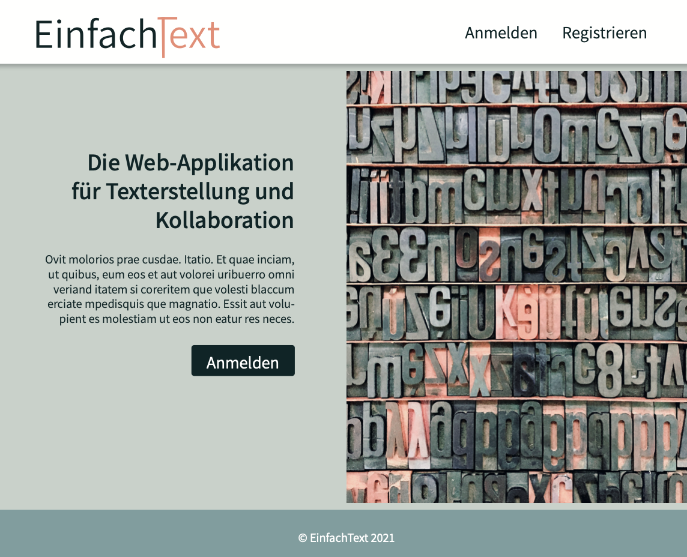

# EinfachText-Frontend-Prototype
Prototype of an old version of my Master in Web Engineering Project «EinfachText»-Frontend

### Bezeichnung des Projektes:

#### Zieldefinition

Um die Schwierigkeiten in der Produktion von Web & Print zu reduzieren, möchte ich eine erste Demoversion (Prototype) eines Kollaborations-Tools kreieren für unseren Verlag, welches sowohl einen Live-Text-Editor besitzt, wie auch erste Kollaborationsmöglichkeiten für angemeldete User; wie etwa das Teilen oder Verwalten von Dokumenten und Rechten mittels ID, gleichzeitige Bearbeitung der Dokumente und die Option Anfragen zu versenden um an Dokumenten zu arbeiten und die Erhaltung von Benachrichtigungen solcher Anfragen.

Dieser erste Prototype soll als Demo dienen, um später ein grösseres und vielseitigeres Kollaborations-Tool zu kreieren, welches unter anderem die simultane Produktion von Print- & Web-Content ermöglicht, wie auch die Zusammenarbeit erleichtert zwischen den verschiedenen Autoren, dem Content Management, dem Lektorat, den Layouter und so weiter; so soll beispielsweise die Möglichkeit bereitstehen, dass die Autoren sowohl in diesem Tool arbeiten können, wie auch, dass Word-Docs. importiert werden können und die Layouter sowohl mit den Online-Dokument, wie auch den Word-Docs. alles in Layout-Programm InDesign importieren können. Dies würde die Möglichkeit erschaffen, leichter und zeitsparender für Print & Web zu produzieren.

#### Implementierte Technologien und Features 

•	API mit Node.JS und JavaScript sowie Datenbankanbindung an MongoDB und Mongoose
•	Authentifikation und Autorisation von Usern mittels Dokument IDs zur leichteren Kollaboration sowie auch die Option, dass bestimmte User Anfragen versenden und Berechtigungen erhalten können
•	Erstellung eines Backends mit Express.JS
•	Frontend mit React.JS und Anbindung an die entwickelte API
•	Integration eines bereits bestehenden Open Source Texteditors wie Slate.JS oder Quill.JS mit CRUD Operationen zur Bearbeitung von Dokumenten und Text
•	Integration von Socket.IO für Live Editing, Kollaboration zwischen Usern und Notifikationen/Benachrichtigungen

#### Massnahmen 
•	Technologien Recherche & Vorbereitung
•	Inhalts- & Seitenkonzept mit Screendesign
•	Erstellung der API und Anbindung an MongoDB Datenbank
•	Entwicklung des Frontends mit React.JS mit Anbindung an die entwickelte API
•	Einbindung eines – zu Testzwecken vorläufigen – Open Source Text-Editors zu Demonstrationszwecken wie etwa Slate.JS oder Quill.JS
•	Integration von Socket.IO zur Echtzeitkommunikation der Benachrichtigungen und Bearbeitung von Texten
•	Testing & Debugging
•	Integration von Beispielen und Content zu Demonstrationszwecken